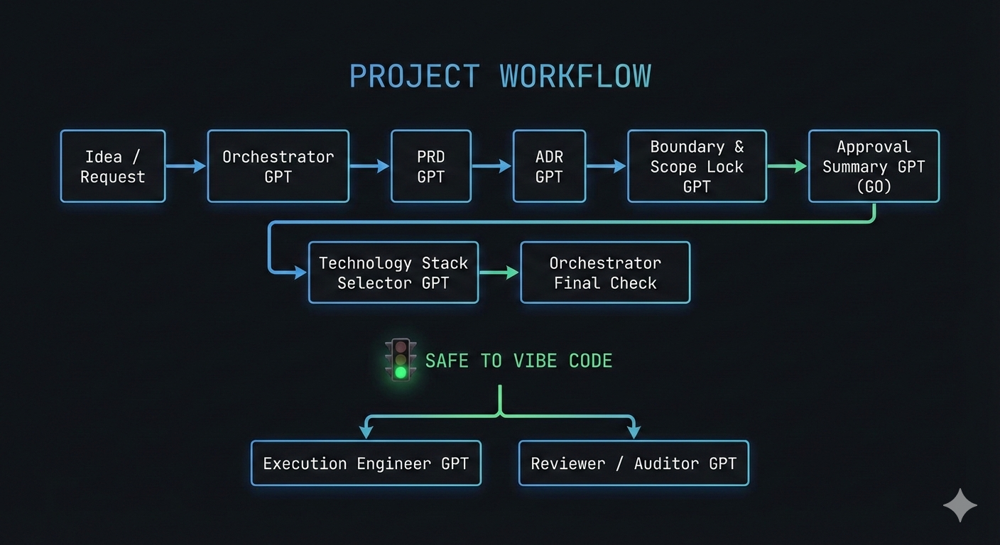

# 🧠 Vibe Engineering Operating System (VE-OS)

A **decision-grade, approval-safe, GPT-assisted engineering workflow**  
designed to enable **fast, disciplined vibe coding** without scope creep,
architecture drift, or approval ambiguity.

---

## 🎯 Purpose

VE-OS exists to solve one core problem:

> **Vibe coding fails when decisions are implicit.**

This system ensures:
- Decisions are explicit
- Risks are acknowledged
- Scope is frozen
- Stack choices are justified
- Execution is deterministic

Only **after** this is achieved does vibe coding begin.

---

## 🧭 Core Principle

> **Decisions first. Execution second.  
> Speed comes from locked intent, not fast typing.**

---

## 🧠 System Overview

VE-OS is composed of **specialized GPT roles**, each owning **one responsibility** and **one artifact**.

GPTs do **not** replace engineering judgment —  
they **enforce engineering discipline**.

---

## 🧩 GPT Roles & Responsibilities

| GPT | Responsibility | Output |
|---|---|---|
| **Orchestrator GPT** | Process authority & gates | Readiness status, Go / No-Go |
| **PRD GPT** | Clarify *what & why* | Decision-grade PRD |
| **ADR GPT** | Explain *why this design* | Architecture Decision Record |
| **Boundary & Scope GPT** | Freeze responsibility | Boundary & Scope Lock |
| **Approval Summary GPT** | Secure authority | Executive Go / No-Go summary |
| **Technology Stack Selector GPT** | Decide *how to build* | Stack & execution environment |
| **Execution Engineer GPT** | Deterministic implementation | Code |
| **Reviewer / Auditor GPT** | Risk & integrity check | Review verdict |

---

## 🧭 End-to-End Workflow

---

## 🔒 Hard Gates (Non-Negotiable)

| Gate | Requirement |
|---|---|
| PRD → ADR | PRD is decision-grade |
| ADR → Scope | Trade-offs explicitly accepted |
| Scope → Approval | Scope fully frozen |
| Approval → Stack | Go decision explicit |
| Stack → Execution | Stack artifact approved |
| Execution | 🚦 SAFE TO VIBE CODE |

If a gate fails → **execution is blocked**.

---

## 📄 Core Artifacts (Mandatory)

Every project must produce:

1. **PRD (Decision-Grade)**  
   *What & why — with explicit non-goals*

2. **ADR (Architecture Decision Record)**  
   *Why this design — with alternatives & trade-offs*

3. **Boundary & Scope Lock**  
   *What the system is NOT allowed to do*

4. **Approval Summary**  
   *Explicit Go / No-Go with risks accepted*

5. **Technology Stack & Execution Environment**  
   *Backend / frontend / data / infra with pros & cons*

If an artifact does not exist → it does not exist conceptually.

---

## 🧩 Technology Stack Selector (Key Addition)

Stack choice is treated as a **first-class decision**, not an assumption.

The Stack Selector GPT:
- Recommends a stack **based on PRD & ADR**
- Explains **why it fits this project**
- Lists **advantages and disadvantages**
- Separates backend, frontend, data, infrastructure
- Locks the stack for execution

Execution **cannot begin** without this artifact.

---

## ⚙️ Execution Rules

Execution Engineer GPT:
- Implements **only approved scope**
- Uses **only approved stack**
- Introduces **no assumptions**
- Refactors **nothing unrelated**
- Stops and escalates if unclear

> Execution speed comes from obedience to decisions.

---

## 🔍 Review Rules

Reviewer / Auditor GPT:
- Checks alignment with approved artifacts
- Flags scope creep and boundary violations
- Audits assumptions and risks
- Verifies stack compliance
- Issues **Proceed / Conditional / Block** verdict

If it fails later, this review should have caught it.

---

## 🧪 Assumption Handling (Mandatory)

All uncertainty must be labeled:

- `[assumption]` → proceeding cautiously
- `[unverified]` → cannot be confirmed

Assumptions must be:
- Explicit
- Listed
- Reviewable
- Easy to override

Never present assumptions as facts.

---

## 🛑 Stop Conditions

Stop immediately if:
- A GPT escalates
- Scope becomes ambiguous
- Approval is implied, not explicit
- Someone says “just add one more thing”

---

## 🎯 What VE-OS Gives You

- Staff-level engineering discipline
- Fast but safe vibe coding
- Defensible decisions
- Audit-ready documentation
- Repeatability across projects
- Clear authority boundaries

---

## 🔐 Final Reminder

> **You are not using GPTs to code faster.  
> You are using them to think clearer, decide earlier, and execute safely.**

---

## 📌 Status

This operating system is **LOCKED** unless explicitly revised.

Any change to:
- Scope
- Architecture
- Stack
- Approval assumptions

→ requires a **new decision artifact**.

---

**Owner:** f_A-I_S_A_L  
**Version:** 1.0  
**Philosophy:** Planning before coding, always.

